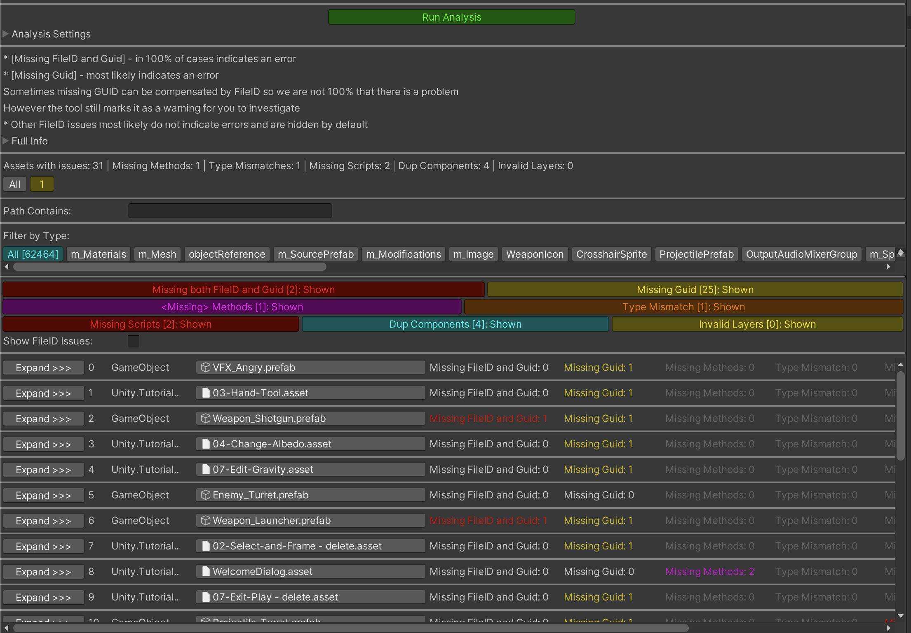

# Missing References Hunter Unity3D Tool 


[](https://opensource.org/licenses/MIT)
[](https://GitHub.com/Naereen/StrapDown.js/graphs/commit-activity)

##
This tool detects missing references in your assets.

All code combined into one script for easier portability.
So you can just copy-paste [MissingReferencesHunter.cs](./Editor/MissingReferencesHunter.cs) to your project in any Editor folder.

# How it works

At first, it collects all your project GUIDs and forms a map of them.

Then it reads the contents off all GameObjects, ScriptableObjects and Scenes to gather GUIDs they contain.

Then it simply checks whether these GUIDs are present in the map from the first step.

It also checks whether GameObjects, ScriptableObjects and Scenes contain local references (e.g. fileID) to non existing parts of itself.
All occurrences of {fileID: 0} are also treated as warning because they might be forgotten references.

The whole process might take few minutes for huge projects.

## To list all missing references in your project...
..click on "Tools/Missing References Hunter" option which will open the window. 

Press "Run Analysis" button to run the analysis (can take several minutes depending on the size of your project).



## Scan scope

The tool scans serialized data for GameObjects/prefabs, ScriptableObjects, and scenes.
It reads serialized file contents to inspect GUIDs, FileIDs, UnityEvent data, script references, and layer values.

Some checks are optional and can be enabled or disabled before running analysis:

- `<Missing> Methods` checks UnityEvent callbacks whose target method no longer exists.
- `Type Mismatch` checks UnityEvent object-argument types that cannot be resolved from loaded assemblies.
- `Missing Scripts` checks MonoBehaviour script GUIDs that no longer resolve to a script asset.
- `Duplicate Components` checks prefab GameObjects with more than one component of the same type.
- `Invalid Layers` checks serialized `m_Layer` values against `ProjectSettings/TagManager.asset`.

## Working with results

* [Missing FileID and Guid] - in 100% of cases indicates an error like on the screenshot below


* [Missing Guid] - most likely indicates an error. Sometimes missing GUID can be compensated by FileID 
so we are not 100% that there is a problem. However the tool still marks it as a warning for you to investigate

* Other FileID issues most likely do not indicate errors and are hidden by default

Suggested triage order:

- Red issues first: `[Missing FileID and Guid]` and missing scripts usually indicate broken serialized references.
- Yellow issues next: `[Missing Guid]`, type mismatch, and invalid layers usually need investigation.
- Cyan/FileID-only issues last: these are more often Unity-internal or edge-case serialization details.

## How it works

Unity uses FileID and GUID entities to identify and assign assets to each other

This tool scans all assets to find all FileIDs and / or GUIDs that are assigned to a field
but do not exist neither in current asset nor in all project


There are several types of issues that might occur during this analysis

* [Missing FileID and Guid] - both identifiers do not exist


in that case we are 100% sure that there is a missing reference so we mark it with red color

* [Missing Guid] - only Guid does not exist
* [Missing FileId] - only FileId does not exist

this issues need further investigation by you because there might be or not a missing reference since it can be somehow processed by some internal Unity code


[Missing FileId] usually involves more internal nuances and less likely indicates an error and so we mark it as non-warning (cyan)

however [Missing Guid] most of the times indicates that there are some errors so we mark it as yellow

```
In most cases you just need to fix [Missing FileID and Guid] and [Missing Guid] issues
```

That is why other filters are hidden by default and most of the users won't need them

* please also note that not all missing references are presented in Unity inspector
* some of them might be hidden if current serialization doesn't cover fields that contain errors
* or some of them might be replaced by custom inspectors etc

* so in some cases you need to enable Debug inspector view or even dive into the asset file text contents

When a result is not visible in the normal Inspector, try:

- Switch the Inspector to Debug mode and inspect serialized fields directly.
- Open the asset/scene YAML text and use the reported line number or field type to locate the reference.
- For UnityEvent issues, check event target objects and method dropdowns on affected components.
- For missing scripts, look for `Missing (Mono Script)` components on the reported prefab or scene object.


This tool also collects some other info:

* [Missing Local FileID] - might indicate that there is some issue with internal objects referencing each other
* [Empty Local FileID] - might indicate an empty internal field 

these two fields provide some very specific info that is rarely needed for most of users

* [Missing Methods] - UnityEvent references a method that no longer exists on the target type (often after rename/delete); the Inspector may show `<Missing>` in the event dropdown when that scan is enabled
* [Type Mismatch] - UnityEvent object-argument type cannot be resolved from loaded assemblies (e.g. deleted or renamed class referenced in serialization)
* [Duplicate Components] - more than one component of the same type on the same GameObject in prefabs (flagged when that scan is enabled; some duplicates may be intentional)
* [Invalid Layers] - GameObject `m_Layer` index does not correspond to a defined layer in TagManager / Project Settings

## Installation

 1. Just copy and paste file [MissingReferencesHunter.cs](./Editor/MissingReferencesHunter.cs) inside Editor folder
 2. via Unity's Package Manager using link https://github.com/AlexeyPerov/Unity-MissingReferences-Hunter.git

## Contributions

Feel free to report bugs, request new features
or to contribute to this project!

---

## Other tools


##### Unity Scanner

- To analyze the whole project for various issues [Unity-Scanner](https://github.com/AlexeyPerov/Unity-Scanner).

##### Dependencies Hunter

- To find unreferenced assets in Unity project see [Dependencies-Hunter](https://github.com/AlexeyPerov/Unity-Dependencies-Hunter).

##### Addressables Inspector

- To analyze addressables layout [Addressables-Inspector](https://github.com/AlexeyPerov/Unity-Addressables-Inspector).

##### Textures Hunter

- To analyze your textures and atlases see [Textures-Hunter](https://github.com/AlexeyPerov/Unity-Textures-Hunter).

##### Materials Hunter

- To analyze your materials and renderers see [Materials-Hunter](https://github.com/AlexeyPerov/Unity-Materials-Hunter).

##### Asset Inspector

- To analyze asset dependencies [Asset-Inspector](https://github.com/AlexeyPerov/Unity-Asset-Inspector).

##### Editor Coroutines

- Unity Editor Coroutines alternative version [Lite-Editor-Coroutines](https://github.com/AlexeyPerov/Unity-Lite-Editor-Coroutines).
- Simplified and compact version [Pocket-Editor-Coroutines](https://github.com/AlexeyPerov/Unity-Pocket-Editor-Coroutines).

