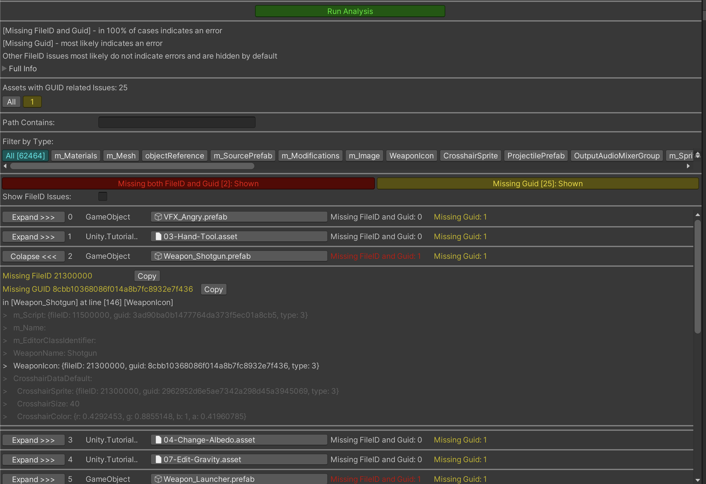

# Missing References Hunter Unity3D Tool 

##
This tool detects missing references in your assets.

All code combined into one script for easier portability.
So you can just copy-paste [MissingReferencesHunter.cs](./Packages/MissingRefsHunter/Editor/MissingReferencesHunter.cs) to your project in any Editor folder.

# How it works

At first, it collects all your project GUIDs and forms a map of them.

Then it reads the contents off all GameObjects, ScriptableObjects and Scenes to gather GUIDs they contain.

Then it simply checks whether these GUIDs are present in the map from the first step.

It also checks whether GameObjects, ScriptableObjects and Scenes contain local references (e.g. fileID) to non existing parts of itself.
All occurrences of {fileID: 0} are also treated as warning because they might be forgotten references.

The whole process might take few minutes for huge projects.

## To list all missing references in your project...
..click on "Tools/Missing References Hunter" option which will open the window. 

Press "Run Analysis" button to run the analysis (can take several minutes depending on the size of your project).

## To list missing references for selected assets...
..click on "Find Missing References" option in the context menu.

It will launch the analysis and show the results as they are ready.

## Working with results

[Unknown Guids] - assets that has references to assets that no longer exists (like on the screenshot below)

[Local Refs Warnings] - assets that has:
* internal refs to child objects that no longer exist
* internal refs with null values e.g. empty array item

[Assets With No Warnings] - assets with valid references only

## Installation

 1. Just copy and paste file [MissingReferencesHunter.cs](./Packages/MissingRefsHunter/Editor/MissingReferencesHunter.cs) inside Editor folder
 2. [WIP] via Unity's Package Manager 

## Contributions

Feel free to [report bugs, request new features](https://github.com/AlexeyPerov/Unity-MissingReferences-Hunter/issues) 
or to [contribute](https://github.com/AlexeyPerov/Unity-MissingReferences-Hunter/pulls) to this project!

## Other tools

##### Dependencies Hunter

To find unreferenced assets in Unity project see [Dependencies-Hunter](https://github.com/AlexeyPerov/Unity-Dependencies-Hunter).

##### Textures Hunter

To analyze your textures and atlases see [Textures-Hunter](https://github.com/AlexeyPerov/Unity-Textures-Hunter).

 
